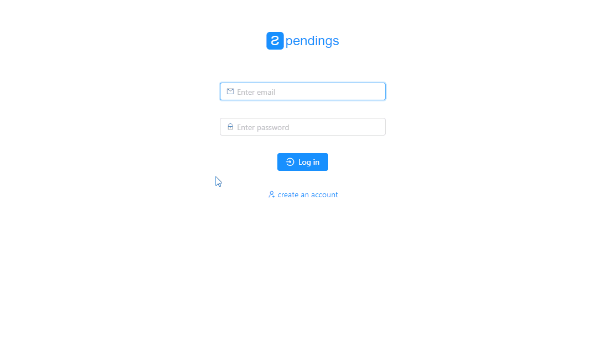

# Spendings

Application that helps you to record your everyday spendings



### Installation
1. `npm install` - install node modules
2. Start [backend API](https://github.com/taras-d/spendings-api)
3. Set API address in the [index.html](src/index.html#L20)

### Running for development
```bash
npm start        # Start webpack dev server
```

### Building for production
```bash
npm run build    # Prepare app for production (minify bundles, copy assets, etc.)
```
